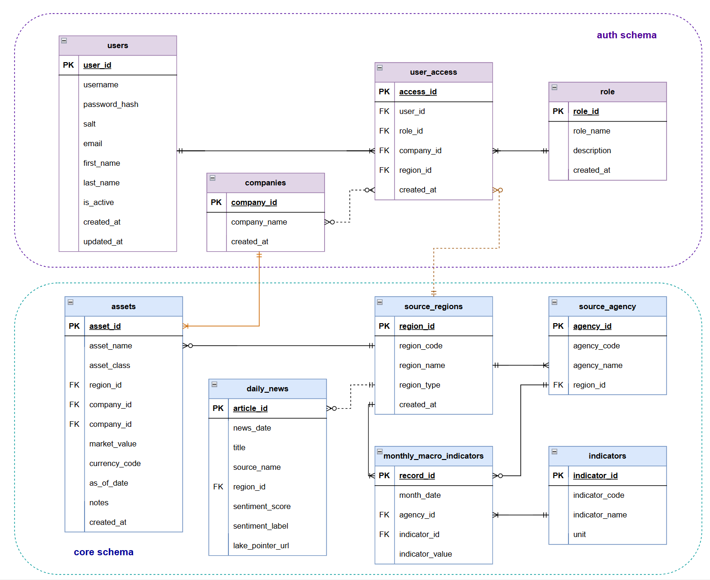

# Macroeconomic Indicators and Sentiment Database

[](https://creativecommons.org/licenses/by-nc/4.0/)
[](https://www.python.org/)
[](https://www.microsoft.com/sql-server/)

An end-to-end data project that combines macroeconomic indicators with financial-news sentiment for the period 2007-2023.

The pipeline collects data from FRED, Eurostat, Kaggle, and Hugging Face; scores news with FinBERT; stores normalized results in Microsoft SQL Server; and presents region-aware analytics through a Streamlit dashboard.

**Course:** Advanced Data Management

**Author:** Zahra Younes Pour Langaroudi

**Institution:** University of Trieste - M.Sc. in Data Science and Artificial Intelligence

## Architecture

The repository is organized into four main areas:

- **Files:** immutable source data in `data/raw/` and reusable FinBERT results in `data/processed/`.
- **Core database:** normalized regions, agencies, indicators, monthly observations, news, and example assets in the `core` schema.
- **Analytics and access:** monthly analytical views in `analytics`, plus users, roles, companies, and scoped permissions in `auth`.
- **Application:** `streamlit_app.py` provides authenticated access to regional indicators, sentiment, news content, and authorized assets.



## Quick Start

### Requirements

- Python 3.8 or later
- Microsoft SQL Server
- ODBC Driver 17 for SQL Server, or another driver supplied through `DB_DRIVER`
- A FRED API key when source data must be downloaded again

Install the Python dependencies:

```bash
pip install -r requirements.txt
```

Create a SQL Server database named `MacroSentimentDB`, then run the SQL files in this order:

```text
scripts/01_create_schemas.sql
scripts/02a_create_source_regions.sql
scripts/02b_build_core_tables.sql
scripts/03_create_analytics_view.sql
scripts/03b_create_monthly_region_wide_view.sql
scripts/04_create_auth_tables.sql
scripts/05_create_access_views.sql
scripts/06_create_assets_table.sql
```

Open `scripts/data_prep.ipynb`, provide the required FRED key and database connection, and run the notebook from top to bottom. A precomputed FinBERT checkpoint is included at `data/processed/finbert_article_scores.csv`.

Configure the dashboard connection if the defaults do not match your environment:

```text
DB_SERVER=your-server
DB_DATABASE=MacroSentimentDB
DB_DRIVER=ODBC Driver 17 for SQL Server
```

Start the application:

```bash
streamlit run streamlit_app.py
```


## Documentation

- [`DMP.md`](DMP.md): scope, architecture, tables, governance, security, preservation, and reproducibility.
- [`metadata/data_dictionary.json`](metadata/data_dictionary.json): field-level metadata.
- [`metadata/data_lineage.jsonld`](metadata/data_lineage.jsonld): source and transformation lineage.
- [`metadata/dataset_metadata.jsonld`](metadata/dataset_metadata.jsonld): descriptive dataset metadata.

## License

Project code, metadata, and eligible derived outputs are licensed under [CC BY-NC 4.0](https://creativecommons.org/licenses/by-nc/4.0/). Upstream data remains subject to the terms of FRED, Eurostat, Kaggle, Hugging Face, and the original data providers.
